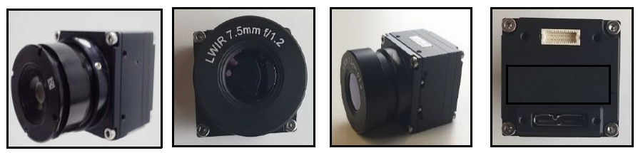
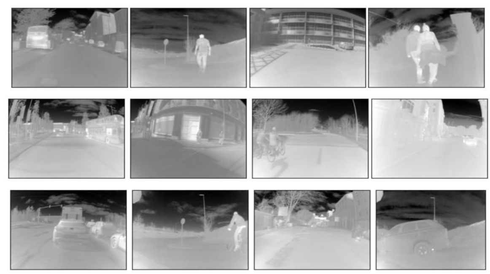

# Thermal-YOLO Deployment & Validation on GPU and Edge-GPU Platforms

This study is related to object detection in thermal infrared spectrum using YOLO-V5 framework for ADAS application. The trained network variants of YOLO-V5 are validated on GPU as well two different edge devivces which inlcude NVIDIA JETSON NANO and NVIDIA JETSON XAVIER boards.

Download the YOLO-V5 from the following link
Link: https://github.com/ultralytics/yolov5

Install all the required pacakages to run YOLO-V5 on server or local machine

Downlaod the models trained on thermal data from trained models folder and put in runs/train folder inside yolo-v5 directory.

The trained models can be tested on thermal data.
