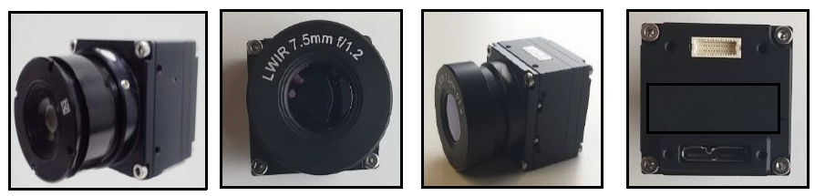
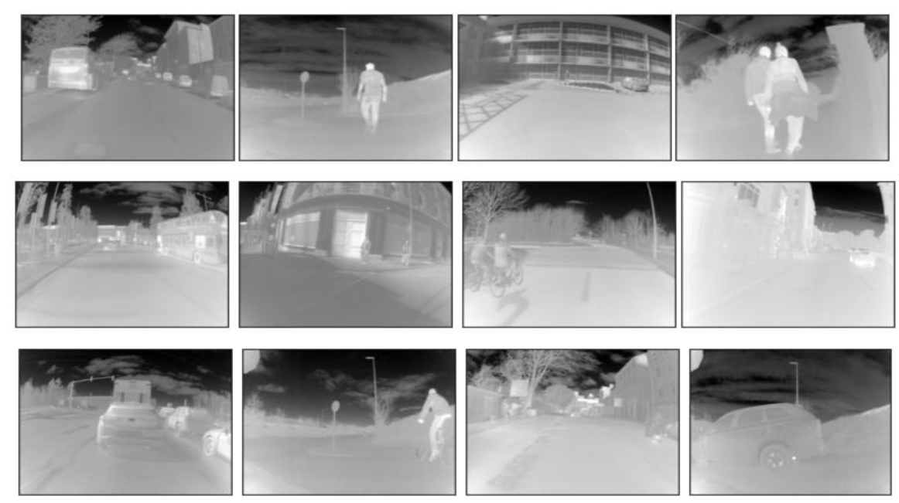
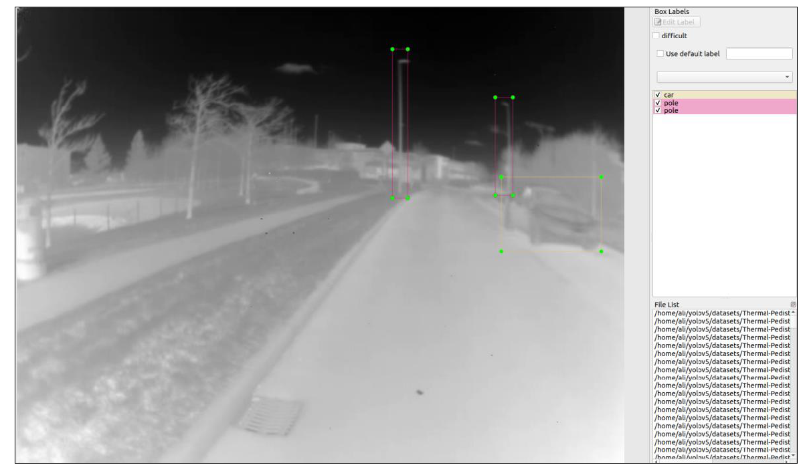

# Thermal-YOLO-V5 Deployment & Validation on GPU and Edge-GPU Platforms

This study is related to object detection in thermal infrared spectrum using YOLO-V5 framework for ADAS application. The trained network variants of YOLO-V5 are validated on GPU as well two different Edge-GPU devices which inlcude NVIDIA JETSON NANO and NVIDIA JETSON XAVIER NX boards.







<br>

YOLO-V5 repository can be downloaded from below link .<br>

```bash
https://github.com/ultralytics/yolov5
```
<br>

Install all the required pacakages to run YOLO-V5 on server or local machine

Downlaod the models trained on thermal data from trained models folder and put in runs/train folder inside yolo-v5 directory.

The trained models can be tested on thermal data.
